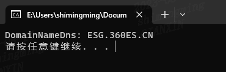

<h1 align="center">Welcome to GetDominName 👋</h1>
<p>
  
</p>

> windows系统下获取系统主机域名

### How to use

Open vcproj and compile it

### win api

[DsRoleGetPrimaryDomainInformation 函数 (dsrole.h) - Win32 apps | Microsoft Learn](https://learn.microsoft.com/zh-cn/windows/win32/api/dsrole/nf-dsrole-dsrolegetprimarydomaininformation)

```cpp
DsRoleGetPrimaryDomainInformation
```


### Run Screenshoot




## Author

👤 **holdyounger**

* Website: holdyounger.github.io
* Github: [@holdyounger](https://github.com/holdyounger)

## Show your support

Give a ⭐️ if this project helped you!

***
_This README was generated with ❤️ by [readme-md-generator](https://github.com/kefranabg/readme-md-generator)_